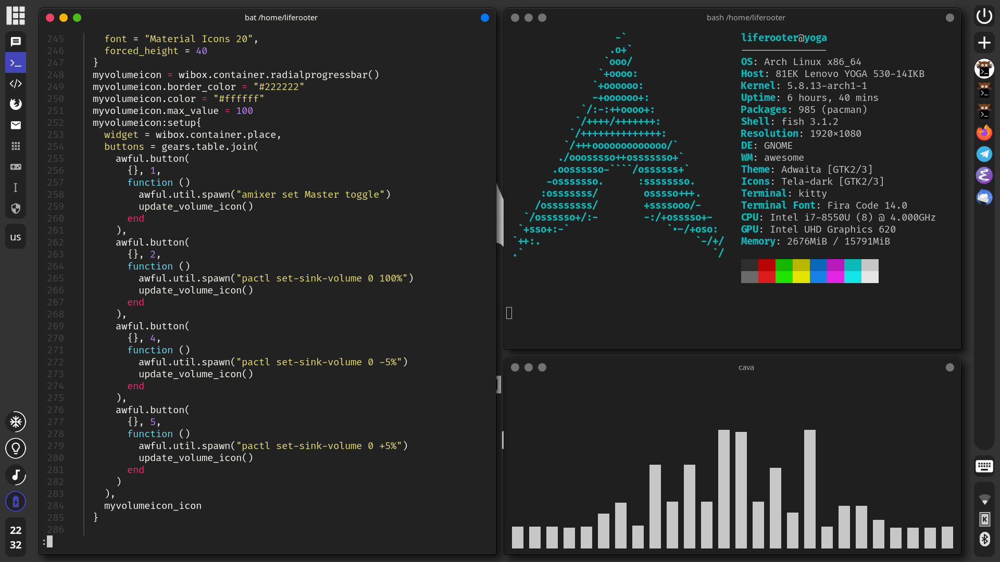
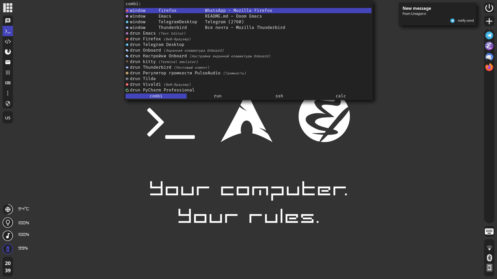

# my-awesome-wm
My AwesomeWM configs

## Dependencies
### Required:
- AwesomeWM - *git version*
- Arch Linux - my Linux distribution
- checkupdates+aur - look for new versions of programs
- dex - .desktop interpreter, for autostart
- Tela icon theme - beautiful icon theme
- Noto Sans - default font
- light - brightness control
- picom - not tryone, just normal picom
- alsa - for audio control
- xss-lock - as screensaver
- i3lock-color - pretty locker
- lm_sensors - for CPU temperature applet
- deadd-notification-center - notification center
### Optional:
- nm-applet - for network applet
- blueman - for bluetooth configuration
- kwallet - it is kwallet, you know
- polkit-kde - polkit agent
- kitty - default terminal
- Fira Code font - for my kitty
- xfce4-power-manager - pretty good power manager
- rofi-calc - calculator in rofi
- rofi-bitwarden (aka bwmenu) - Bitwarden in rofi
- clipmenu - clipboard history on top of rofi
- acpid - rofi menu on power button
- dconf and gsetting - to set icon theme for Qt apps
- lxappearance - theming
- Materia GTK, Materia Kvantum - my GTK and Qt themes, I recommend them
- Kvantum - Qt theme engine
- Capitaine cursors - my curcor theme
- Flameshot - the best screenshot utility for Linux
- playerctl - control your player

## Installation
1. Clone my repo with submodules to ~/.config/awesome:
`
git clone --recursive https://github.com/liferooter/my-awesome-wm ~/.config/awesome
`
2. Copy (or symlink) my kitty and rofi configs into your ~/.config (rofi and deadd configs is necessary, kitty config is optional):
`
ln -s ~/.config/awesome/config/* ~/.config/
`
3. Install my iconic fonts:
`
mkdir -p ~/.local/share/fonts
cp ~/.config/awesome/fonts/* ~/.local/share/fonts/
`
4. Enable acpid and deadd:
`
sudo systemctl enable --now acpid
systemctl --user enable --now deadd-notification-center
systemctl --user enable --now clipmenud
`
5. Copy my xinitrc and xprofile to your home:
`
cp ~/.config/awesome/xinitrc ~/.xinitrc
cp ~/.config/awesome/xprofile ~/.xprofile
`
6. Set Tela-dark icon theme via gsettings:
`
gsettings set org.gnome.desktop.interface icon-theme 'Tela-dark'
`
7. Set Materia GTK theme, Tela-dark icon theme and Capitaine cursors (I recommend use lxappearance to do it)

8. Restart your computer and enjoy my AwesomeWM. Get updates, learn Lua, AwesomeWM API and my configs (oh, they are very bad to learn, they are very bad at all)
